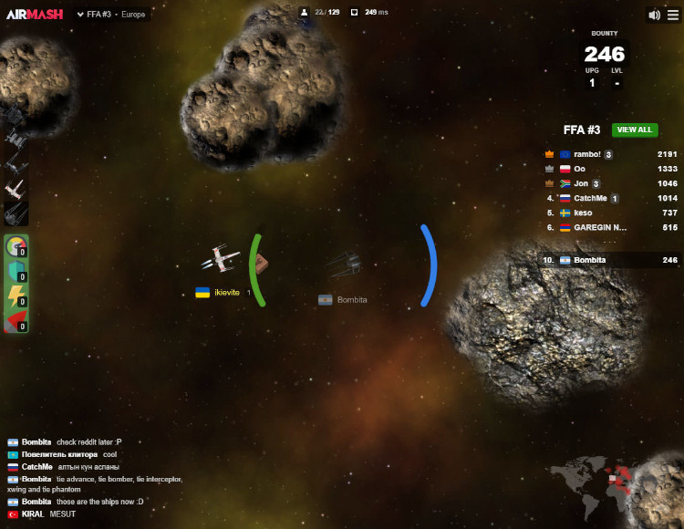
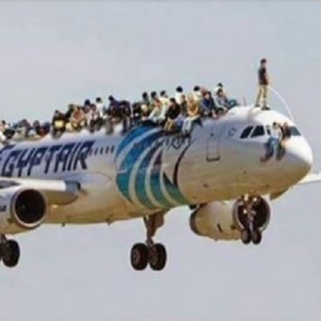

# AIRMASH - the game that refused to die

The game [Airmash](https://airmash.online) was announced on Dec 10 2017 on Hacker News by a user named *fivesigma*. The [announcement post](https://news.ycombinator.com/item?id=15892066) became one of the most upvoted posts on Hacker News, and the game became very succesful in the year to come. 

But it would have a very rocky history.

Airmash is an online multiplayer game in which players fly around in different kind of aircrafts, shooting each other into oblivion with missiles to earn points. The game has an HTML5/javascript frontend, and originally had a NodeJS server engine. 

  
*Airmash screenshot by the original author of the game.*

## The glory years

A lot of people found playing the game much fun and very entertaining. During the initial success of Airmash it gave birth to a small community which mainly used the [Reddit page](https://www.reddit.com/r/airmash) as its discussion platform. The author, active on the Reddit page as ninesigma, took suggestions from the community and published updates to the game.

There were three variations of the game. *Free For All* was the simple shoot-m-up kind of game. *Capture The Flag* was the game were two teams tried to steal each others flag. *Battle Royale* was a game where only one type of aircraft was allowed at the same time, and where the last remaining player won. The games, divided over several servers in several continents, were visited by hundreds of players each day.

One of the players from this community, Bombita, [published a Star Wars-themed mod](https://www.reddit.com/r/airmash/comments/7kkjye/a_star_wars_mod/) called [Starmash](https://www.starma.sh) on Dec 18, 2017. Apart from being a skin, Starmash was also a modding platform to which players could add their own Airmash mods, themes and extensions. Since the original game had been announced on Hacker News, there was a large share of programmers in the audience. In the months that followed, several players created their own mods and extensions. 

  
*Starmash by Bombita.*

## Nastiness arrives

Because zooming out was one of the advantages that Starmash brought into the game, there were players who took offense and considered this cheating. After a while a nasty bot appeared on Airmash, that insulted Bombita in a private chat to each player that connected. 

There were also other nasty bots appearing, that muted other players, or drowned out players from the scoreboard, or connected in very large numbers. These bots were disruptive to the gameplay, and were hard to prevent. 

The one who could have prevented this, was of course the original author, Tony a.k.a. fivesigma a.k.a. ninesigma. Unfortunately however, his last comment on HN was on Dec 10 2018; on Reddit his last comment was Jan 19, 2018. He was never heard from since. 

## Doomsday

Of course this only gradually became apparent. Although the nasty bots left, one of the major omens was that the https certificates for the domains that were used at the time, airma.sh and subdomains, were not properly being renewed. The certificates would expire, and after that browsers would block traffic to that subdomain. The date at which the backend services would stop working became known as Doomsday or the Mashpocalypse, and everyone kept hoping that fivesigma would reappear and renew the certificates. 

But he didn't. The certificates expired on Nov 23 23:26:40 2018 GMT. 

Moments before the Doomsday event, the regular crowd gathered in a Capture The Flag game to honor the game and say goodbye. In a circle with friends and foes gathered around the flag, the moment came. After that, it was not possible to connect to the game any longer. The chat log of the conversation was posted [on Reddit later](https://www.reddit.com/r/airmash/comments/a14t74/public_chat_logs_of_the_last_day_from_2123_did/). 

  
*The goodbye ritual on Doomsday, with a special Doomsday fire overlay by Bombita. Other images [here](https://imgur.com/gallery/hY3bFbL).*

## Staying alive

But it was not all over. Soon hacks appeared to circumvent the certificate errors. Also a new site appeared, airmash.online, by user Congratulatio, which mirrored the original frontend and proxied the connections to the backend so browsers wouldn't complain. 

Also a player called Steamroller had been working on an alternative server in Rust. The server was still in development, but could already be played.

Because it wasn't obvious how to connect to the game any longer, with the default domain airma.sh erroring out, the game lost a lot of it's players. Which makes it less attractive to play, because if there aren't any other players around, it isn't really fun to play. 

In Dec 2018 bots that could actually play the game started to appear. The bot code was originally written as a Starmash extension by user Spatie. The bots kept players engaged in FFA, even if there were no other real players around to play against. Another user, named Q, wrote bots that could play CTF. 

These hacks, alternatives and bots kept the game somewhat alive. 

On April 24 2019, the original airma.sh servers finally went down. Both the frontend and backend were now gone. 

## Resurrection

The only thing left now was the dev server by Steamroller, but it was still very rough at the edges, and only hosted from South America. Later a player named Derps started hosting the dev server from a server in Europe. Derps also tried to bring the developer-players together and started a Github team [Airmash Refugees](https://github.com/airmash-refugees).

  
*The derpy avatar for Airmash Refugees*

One of the players that was present during the Doomsday event was Wight a.k.a. Rookie. He had been silently working on a new server in Nodejs. He started hosting it and publicly announced its existence on Aug 25 2019. After a while many players agreed that the new server mimicked the previous backend in a reliable way, and that gameplay felt very similar to the original game. 

Because the server was written in Typescript for NodeJS and [Wight posted the source on GitHub](https://github.com/wight-airmash/ab-server), it also allowed more developers to start maintaining and extending it.

After an initial test periode, the server was installed by several different users on several different servers, and has now coverage for FFA and CTF in both the US and Europe. 

## The future of the game

Does the game have a future? There is an enthousiastic core of regular players, who keep coming back. There has been given tremendous time and effort not only by players in engaging in the game, but also in recreating the game from scratch two times, programming the bots, and hosting the frontend, backend and everything inbetween. It looks like some players still believe the game is worth the effort. 

In this respect the game definitely has a future.

On the other hand there are valid concerns about the legal issues and pitfalls surrounding all this enthousiasm. The frontend was scraped and copied to a new server. The name Airmash is a [trademark](https://trademarks.justia.com/875/10/airmash-87510805.html) probably of the original author. The artwork is his copyright by default. These issues will hang above the game as a sword of Damocles as long as there is no formal legal endorsement or permission by the original author, fivesigma.

## What became of fivesigma?

What became of fivesigma or Tony, we don't know. Why he left the game and the community, we don't know. One of the more sobering possibilities is that it maybe just didn't interest him any longer. Curiously, one of his last posts on Reddit was an answer to a user raising suspicion that Tony was "done" with the game. His answer was ["No way"](https://www.reddit.com/r/airmash/comments/7q09l9/gathered_ideas_of_the_community_gathered_during/). 

There has been speculation and stories about what really became of him after he stopped communicating about Airmash, but these are just that: speculation and stories. 

As the Remnant of Airmash players we're just hoping he's doing allright, we thank him for creating the game, and wish him the best.

In the meantime, let's just play another round of [Airmash](https://airmash.online)!

